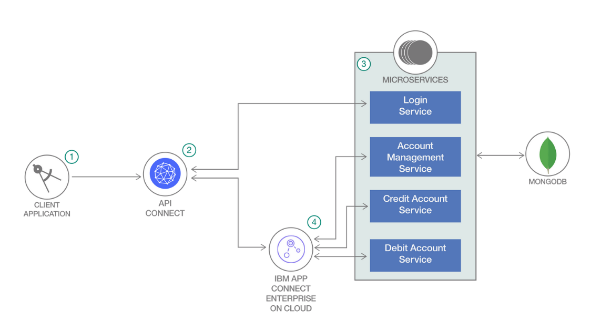
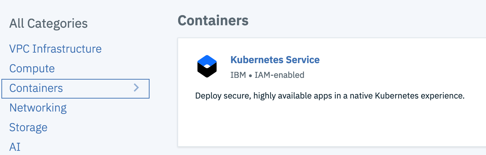
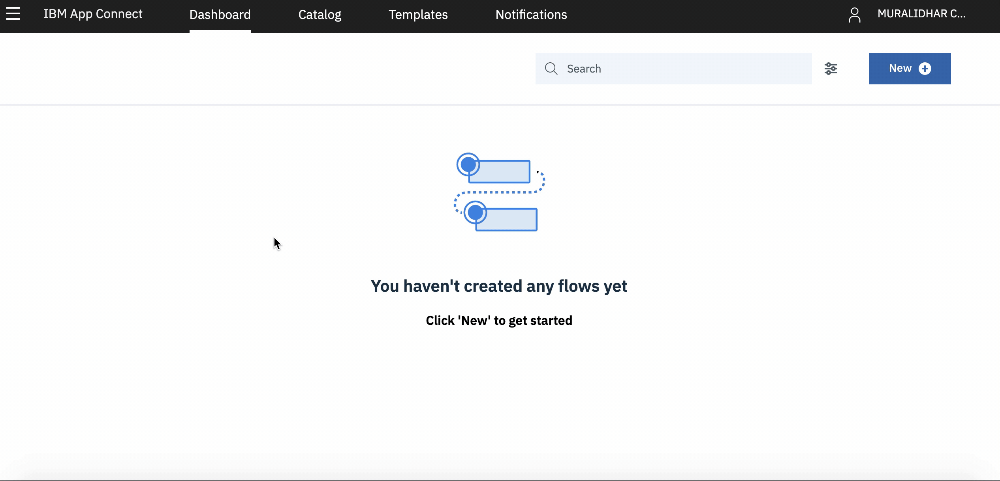
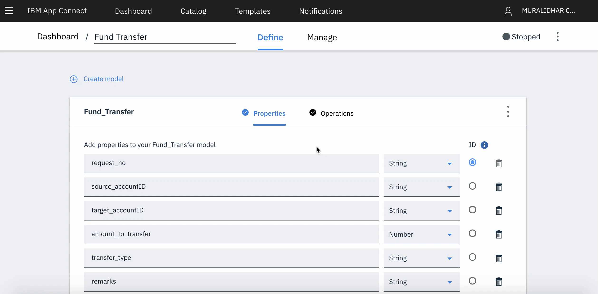
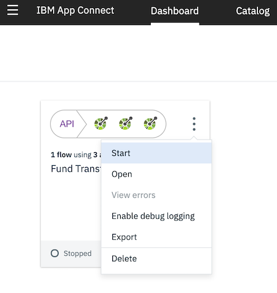
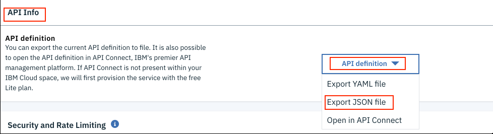
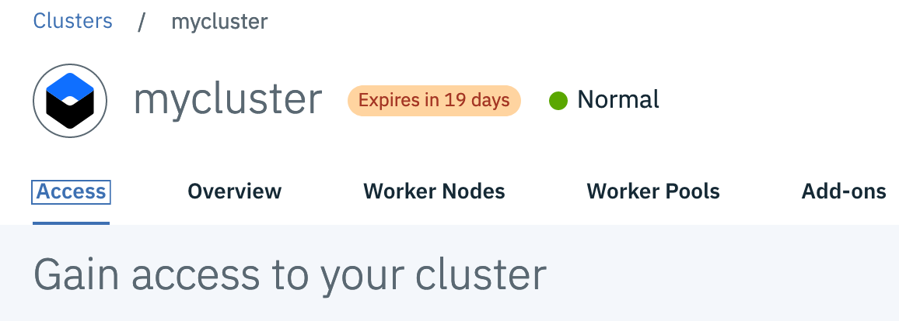
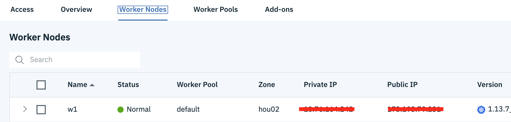

# Build a secure microservices based application using API Connect and App Connect

In a microservices based solution, the common requirements include security of microservices, orchestration (integration with many other applications) of APIs and so on. Such requirements are primarily from the banking and financial services domain.

In this code pattern, we demonstrate a banking solution using IBM API Connect and IBM App Connect. API Connect is used to provide OAuth based authorization security to microservices and App Connect Enterprise for easier and seamless integration of APIs (with zero code) for a business user. The solution comprises authentication and funds transfer functionality.

At the end of this code pattern, users will understand:
* Authentication and authorization using OAuth in API Connect
* A banking funds transfer APIs(credit, debit, ..) orchestration using App Connect
* To build and deploy nodejs microservices on IBM Kubernetes Service
* Integration of API Connect, App Connect, microservices using Node-RED


# Flow



1. User logs-in to the client application.
2. Login Request will go to API Connect.
3. API Connect uses Login API for authentication. And then it generates OAuth token for authorization.
4. Once authentication is successful, user can do `funds transfer` transaction. The request goes to app connect flow which internally uses `Account Management API`, `Credit Account API` and `Debit Account API`. 

> Note:
>  * All microservices are deployed on IBM Kubernetes Service.
>  * All APIs interact with MongoDB.

# Pre-requisites
* [IBM Cloud Account](https://cloud.ibm.com)
* [Git Client](https://git-scm.com/downloads) - needed for clone commands.

# Steps

Follow these steps to setup and run this code pattern. The steps are described in detail below.

1. [Get the code](#1-get-the-code)
2. [Create IBM Cloud Services](#2-create-ibm-cloud-services)
3. [Configure App Connect](#3-configure-app-connect)
4. Configure API Connect
5. [Setup environment for Kubernetes CLI](#5-setup-environment-for-kubernetes-cli)
6. [Deploy Mongo DB](#6-deploy-mongo-db)
7. [Deploy Microservices](#7-deploy-microservices)
8. Deploy webapp
9. Analyze the result

## 1. Get the code

- Clone the repo using the below command.
   ```
   git clone https://github.com/IBM/microservices-using-apiconnect-and-appconnect.git
   ```
   
## 2. Create IBM Cloud Services

### Create IBM Kubernetes Service

Create a Kubernetes cluster with [Kubernetes Service](https://cloud.ibm.com/containers-kubernetes/catalog/cluster) using IBM Cloud Dashboard. This pattern uses the _free cluster_.

  

  > Note: It can take up to 15-20 minutes for the cluster to be set up and provisioned.
  
### Create App Connect service instance

Create an instance of [IBM App Connect](https://cloud.ibm.com/catalog/services/app-connect). Ensure `lite` plan is selected. Click `Create`. A new instance of IBM App Connect should be created.

### Create API Connect service instance


### Create Node-RED service instance

  
## 3. Configure App Connect
Use App Connect to connect your different applications and make your business more efficient. Set up flows that define how data is moved from one application to one or more other applications. App Connect supports a range of skill levels and interfaces, giving you the flexibility to create integrations without writing a single line of code. You can use a web user interface or drop resources into a toolkit that gives a broader range of configuration options. Your entire organization can make smarter business decisions by providing rapid access, visibility, and control over data as it flows through your business applications and systems from a single place - App Connect. Find more App Connect resources in [Learn More](#app-connect-resources-links-for-basic-familiarty) section.


#### Import API interfaces and flow
- On IBM Cloud dashboard, click the App Connect service instance created in earlier step and will be be listed under `Cloud Foundry Services`
- Click `Launch App Connect` button on the App Connect Service home page.

#### Add APIs to Catalog
The [OpenAPI Specification](https://github.com/OAI/OpenAPI-Specification), previously known as the Swagger Specification, is a definition format for describing REST APIs. You can import OpenAPI documents that contain API definitions into IBM App Connect. Each imported document is added as an API to the App Connect catalog of applications and APIs, and can be used to call the API from a flow.

For the microservices used in this code pattern, the REST APIs definition files are available under `app-connect-resources/microservices-apis` folder. 


- On App Connect top menu, click `Catalog` -> `APIs` -> `Add your API or web service now` -> `Add an OpenAPI definition, WSDL or ZIP`
- Browse to `app-connect-resources/microservices-apis` folder and select `Account_Check.json` file.
- Specify the name to be `Account_Check`. While any unique name can be given to APIs, we will maintain the names specified here so that the flow that we will import in later steps work with the APIs, without error.
- Optional. Add a description that summarizes the function of the API.
- Click `Add`.
> Note that the hostname and port are overwritten while connecting to an account.
- Similarly add APIs `Debit_Transaction` (name should be `Debit_Transaction`) and `Credit_Transaction` (name should be `Credit_Transaction`).
- As a sanity check, verify that the microservices are working fine using a REST client like postman.

#### Import flow
- Click `Import Flow` button. The flow should be imported now.
- On the top right corner of the browser page, click the `New` button and select `Import Flow...`.

- Click "Add a YAML file". Browse the cloned repository and select `Flow.yaml` file in `app-connect-resources` folder. 

- When imported click on `Operations` tab -> `Edit Flow` button and verify that there are no visible error indicator.
- You have imported the flow.

#### Test the imported flow
- Now that you have imported the flow, you need to test it.
- Navigate to App Connect dashboard and start the flow.

- Click on the flow on App Connect Dashboard.
- Click `Manage` tab.
- Scroll to the bottom of the page to `Sharing Outside of Cloud Foundry organization` section. Click `Create API Key`.
- Enter a name under `Descriptive name` field and click `Create`.
- `API Portal Link` is populated with a link. Click on that link.
- On the right hand side panel, click on `Try it` link. 
- Under `Parameters -> Data`, enter the input data for rest service and click `Call Operation`. 
- Scroll a little down and you should see response from the service. Response Code should be `200 OK`.


#### Export the App Connect Flow Rest interface
- Navigate to App Connect dashboard.
- Click on the flow on App Connect Dashboard.
- Click `Manage` tab.
- Scroll a little until you find `API Info` section.
- Click `API Definition` that is available on the right side of the page, to see the options. Click `Export JSON File` and save the json file. This file is needed by API Connect to invoke requests to App Connect flows.


## 4. Configure API Connect


## 5. Setup environment for Kubernetes CLI

  * Check the status of your cluster `IBM Cloud Dashboard -> Kubernetes Cluster -> <your cluster>`. If status is not `Normal`, then you need to wait for some more time to proceed further.
    
  * Once your cluster is ready, open the access tab `IBM Cloud Dashboard -> Kubernetes Cluster -> <your cluster> -> Access` as shown in snapshot.

    
    
    Perform the steps provided under this section.
    
  * Verify that the kubectl commands run properly with your cluster by checking the Kubernetes CLI server version.

    ```
    $ kubectl version  --short
    Client Version: v1.9.2
    Server Version: v1.8.6-4+9c2a4c1ed1ee7e
    ```

 **Get the public IP for Kubernetes Cluster**
 
 Once cluster is up and running then find out the public IP of your cluster. It will be required for further steps.

  * Go to `IBM Cloud Dashboard -> Kubernetes Cluster -> <your cluster>`. It gives you details of the cluster.

  * Access `Worker Nodes` tab, it will show you the public IP of your cluster as shown in below screenshot.

    
  
   Make a note of this public IP. It will be used in next step.

## 6. Deploy Mongo DB

In this pattern, mongo db will be deployed in a container and will be used by all the microservices. Perform the following steps to deploy Mongo DB in a container.

```
   $ cd mongodb
   $ kubectl create -f deploy_mongodb.yaml
```

After deployment, the status can be checked as:
```
   $ kubectl get pods
   NAME                    READY   STATUS    RESTARTS   AGE
   mongo-8dc7685d7-nxrcr   1/1     Running   0          73s

   $ kubectl get services |grep mongo
   mongo        NodePort    172.21.84.39   <none>        27017:32643/TCP   11m
```

The hostname and port to connect to mongodb will be `<public_ip_of_cluster>:<mongo_service_port>`. The mongo_service_port in this case, is 32643 (as shown in the above command).

## 7. Deploy Microservices

As explained in step xx, we are creating login, bank account management, credit account and debit account functionality as microservices. Some user credentials and a few bank account details are pre-defined in Mongo DB. 

Perform the following steps to deploy microservices.

**Update MongoDB Connection String**

Prepare connection url as explained in step 6. Then execute the following commands to update mongo db connection URL in app.js of all four microservices. 

```
   cd Microservices
   sed -i '' s#CONNECTION_URL#x.x.x.x:port# login_service/app.js
   sed -i '' s#CONNECTION_URL#x.x.x.x:port# account_management/app.js
   sed -i '' s#CONNECTION_URL#x.x.x.x:port# debit_service/app.js
   sed -i '' s#CONNECTION_URL#x.x.x.x:port# credit_service/app.js   
```

**Prepare deploy target**

All four docker images needs to be pushed to your docker image registry on IBM Cloud. You need to set the correct deploy target. Depending on the region you have created your cluster in, your URL will be in the following format:

```
   <REGION_ABBREVIATION>.icr.io/<YOUR_NAMESPACE>/<YOUR_IMAGE_NAME>:<VERSION>
```

The following command tells you the Registry API endpoint for your cluster. You can get region abbreviation from the output.

```
   ibmcloud cr api
```

To get namespace use the following command:
```
   ibmcloud cr namespaces
```

For example, to deploy the login microservice to my docker image registry in the US-South region, my deploy_target will be:
```
   us.icr.io/test_s1/login_app:v1.0
```

**Deploy login microservice**

Execute the following steps.

```
$ cd login_service
```
Build dockerfile and push the image to registry.

```
$ ibmcloud cr build -t <DEPLOY_TARGET> .
```

Update image location(deploy target) in `deploy.yaml`.

```
$ sed -i '' s#IMAGE#<DEPLOY_TARGET># deploy.yaml
$ kubectl create -f deploy.yaml 

$ kubectl get services|grep login
login-service   NodePort    172.21.113.169   <none>        8080:32423/TCP    31s
```

Need to repeat the same for all other microservices.

**Deploy account_management service**

Following are the steps for account_management service.

```
  cd account_management
  $ ibmcloud cr build -t <DEPLOY_TARGET> .
  
  $ sed -i '' s#IMAGE#<DEPLOY_TARGET># deploy.yaml
  $ kubectl create -f deploy.yaml 

  $ kubectl get services | grep acc
  account-details-service   NodePort    172.21.166.106   <none>        8080:32424/TCP    33s
```

**Deploy debit_account service**

Following are the steps for debit account service.

```
  cd debit_service
  $ ibmcloud cr build -t <DEPLOY_TARGET> .
  
  $ sed -i '' s#IMAGE#<DEPLOY_TARGET># deploy.yaml
  $ kubectl create -f deploy.yaml 

  $ kubectl get services |grep debit
  debit-account-service     NodePort    172.21.138.208   <none>        8080:32425/TCP    16s
```

**Deploy credit_account service**

Following are the steps for credit account service.

```
  cd credit_service
  $ ibmcloud cr build -t <DEPLOY_TARGET> .
  
  $ sed -i '' s#IMAGE#<DEPLOY_TARGET># deploy.yaml
  $ kubectl create -f deploy.yaml 

  $ kubectl get services|grep credit
  credit-account-service    NodePort    172.21.51.254    <none>        8080:32426/TCP    11s
```

All services should be up and running.

## Learn More

### App Connect resources links for basic familiarty
- Introduction to App Connect on Cloud https://developer.ibm.com/integration/docs/app-connect/
- OpenAPI APIs https://developer.ibm.com/integration/docs/app-connect/how-to-guides-for-apps/use-ibm-app-connect-openapi/
- Creating flows for APIs https://developer.ibm.com/integration/docs/app-connect/tutorials-for-ibm-app-connect/creating-flows-api/
- Calling API in a flow https://developer.ibm.com/integration/docs/app-connect/creating-using-apis/calling-apis-flow/
- Toolbox flow https://developer.ibm.com/integration/docs/app-connect/toolbox-utilities/adding-conditional-logic-flow/

<!-- keep this -->
## License

This code pattern is licensed under the Apache Software License, Version 2. Separate third-party code objects invoked within this code pattern are licensed by their respective providers pursuant to their own separate licenses. Contributions are subject to the [Developer Certificate of Origin, Version 1.1 (DCO)](https://developercertificate.org/) and the [Apache Software License, Version 2](https://www.apache.org/licenses/LICENSE-2.0.txt).

[Apache Software License (ASL) FAQ](https://www.apache.org/foundation/license-faq.html#WhatDoesItMEAN)

