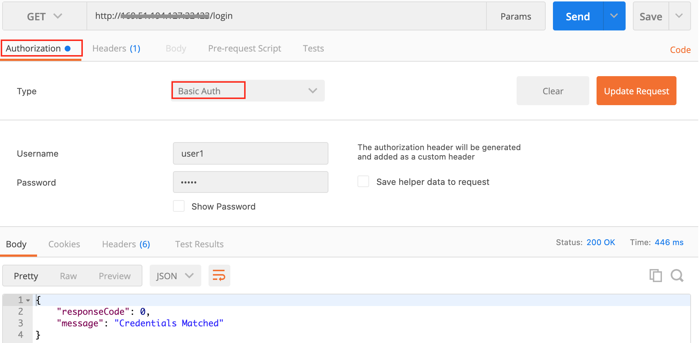
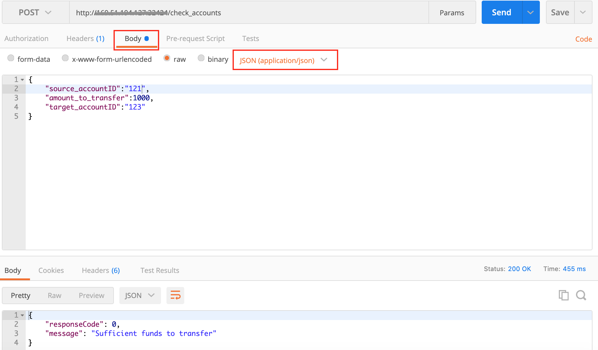
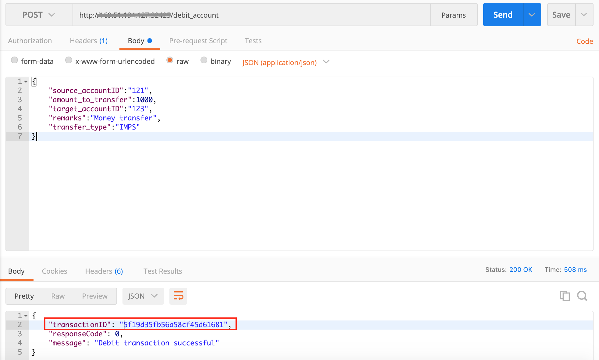
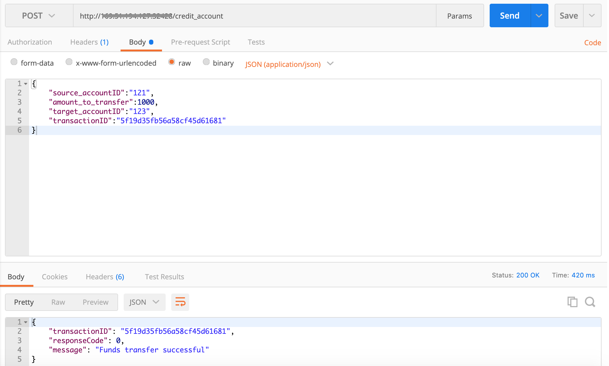

## Testing of Microservices

The deployed microservices can be tested using a tool which enables people to test calls to APIs like Postman or using `curl` command. Follow the below steps to test your deployed microservices.

The microservices can be accessed by using `http://<public_ip_of_your_cluster>:<nodeport_of_your_service>`.
For example: accessing the debit account microservice url will return something like this below on your browser.


A set of user credentials and the following bank account details are populated already in Mongo DB to use/test the application.

*Users details*

```
   {_id: "user1", password: "user1"}
   {_id: "user2", password: "user2"}
   {_id: "user3", password: "user3"}
```

*Accounts details*

```
   {_id: "121", accountholder: "John", funds: 25000}
   {_id: "122", accountholder: "Tim", funds: 15000}
   {_id: "123", accountholder: "Joseph", funds: 250000}
   {_id: "124", accountholder: "Mary", funds: 200000}
```

**Login Service**



Login service uses Basic authorization. If you want to test using curl command, you need to encode username and password before submitting the request.
The curl command for login service is:

```
  curl -X GET \
    http://169.51.194.127:32423/login \
    -H 'authorization: Basic dXNlcjE6dXNlcjE=' \
    -H 'cache-control: no-cache' \
    -H 'postman-token: 948cfb36-4b9d-ac31-7a0f-124615396c5c'
```

**Account Management Service**



Here, input json is -
```
  {
    "source_accountID":"121",
    "amount_to_transfer":1000,
    "target_accountID":"123"
  }
```

Alternate curl command is - 

```
  curl -X POST \
    http://169.51.194.127:32424/check_accounts \
    -H 'cache-control: no-cache' \
    -H 'content-type: application/json' \
    -H 'postman-token: 547d7a27-ad1e-eafb-ca48-3a58bfc16dc6' \
    -d '{
    "source_accountID":"121",
    "amount_to_transfer":1000,
    "target_accountID":"123"
  }'
```

Corresponding pod logs can be checked for more details.

```
  $ kubectl get pods
  $ kubectl logs -f <podname>
  
  # account_management_service pod will show something like this -

  {"source_accountID":"121","amount_to_transfer":1000,"target_accountID":"123"}
  Mongo DB connection successful
  Target account exists -  [ { _id: '123', accountholder: 'Joseph', funds: 250000 } ]
  Source account exists -  [ { _id: '121', accountholder: 'John', funds: 25000 } ]
  Sufficient funds to transfer
  {"responseCode":0,"message":"Sufficient funds to transfer"}
```

**Debit Account Service**



Input JSON to API is -
```
  {
    "source_accountID":"121",
    "amount_to_transfer":1000,
    "target_accountID":"123",
    "remarks":"Money transfer",
    "transfer_type":"IMPS"
  }
```

The curl command for the same:
```
  curl -X POST \
    http://169.51.194.127:32425/debit_account \
    -H 'cache-control: no-cache' \
    -H 'content-type: application/json' \
    -H 'postman-token: bc5b3749-d101-0ceb-98a3-f6541353cff3' \
    -d '{
    "source_accountID":"121",
    "amount_to_transfer":1000,
    "target_accountID":"123",
    "remarks":"Money transfer",
    "transfer_type":"IMPS"
  }'
```

**Credit Account Service**



Input JSON to API is -
```
  {
	"source_accountID":"123",
	"amount_to_transfer":1000,
	"target_accountID":"121",
	"transactionID":"5f19d77bb56a587c07d61683"
  }
```

The curl command for the same:
```
  curl -X POST \
    http://169.51.194.127:32428/credit_account \
    -H 'cache-control: no-cache' \
    -H 'content-type: application/json' \
    -H 'postman-token: b3ca812d-70ad-bf66-4bde-afd255444d48' \
    -d '{
    "source_accountID":"123",
    "amount_to_transfer":1000,
    "target_accountID":"121",
    "transactionID":"5f19d77bb56a587c07d61683"
  }'
```

For more details, please check Pod logs.


